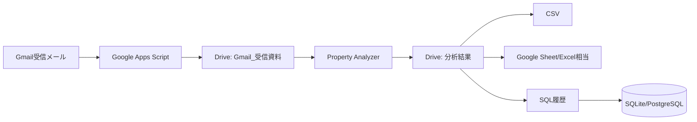

# Architecture

## 構成

- `src/Code.js`: GAS本体。Gmail添付保存、分析、出力、トリガー作成を担当。
- `config/analysis_rules.json`: 分析ルールの原本。
- `lib/propertyScoring.js`: Nodeテスト用の同等スコアリング。
- `tests/`: スコアリングの回帰テスト。
- `.github/workflows/ci.yml`: lint/test/artifact upload。

## 第1段階

Gmail検索条件に一致する添付ファイルをDriveへ保存し、処理済みラベルを付ける。

## 第2段階

保存された資料のファイル名・説明・OCR済みテキストをもとに、価格、賃料、築年数、構造を抽出し、以下を算出する。

- 表面利回り
- 実質利回り
- NOI
- 年間ローン返済額
- 年間キャッシュフロー
- CF比率
- DSCR
- 推定売却益
- 融資目線
- ランキング

## 変更しやすい場所

分析方針を変える場合はまず `config/analysis_rules.json` を修正する。GASへ反映する場合は `src/Code.js` の `ANALYSIS_RULES` も同じ値へ更新する。
